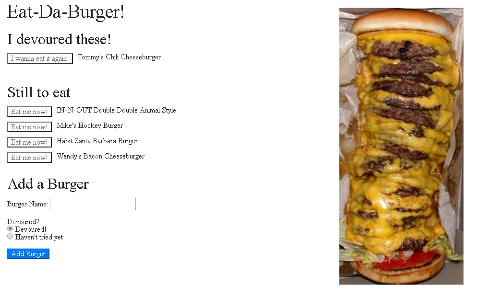

# burger
The burger tracking app. Let's you track burgers you've tried and burgers still not conquered. Take a look at a screen shot:

Yes! That buger on the right is real, it's an In-N-Out 10x10 and it can be ordered at any In-N-Out.

In the Add a Burger section, enter the name of a burger you want to track and select either "Devoured", if you've already tried it or "Haven't tried yet". Your burger will be added to the appropriate section.

When you've eaten a burger click on the "Eat me now!" button next to it to move it to the "I devoured these!" section. Want to move it back for another dinning experience? Click on "I wanna eat it again!" to send it back to "Still To Eat".